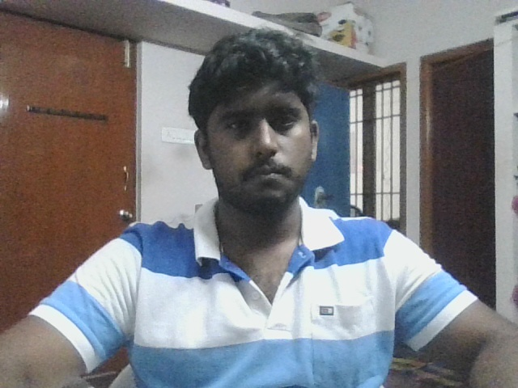
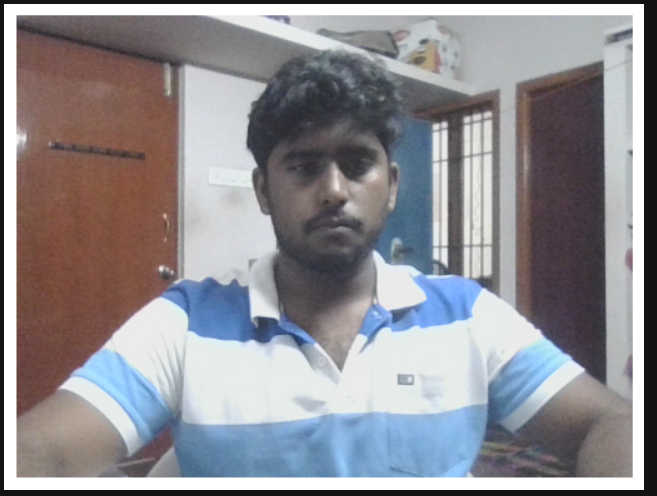
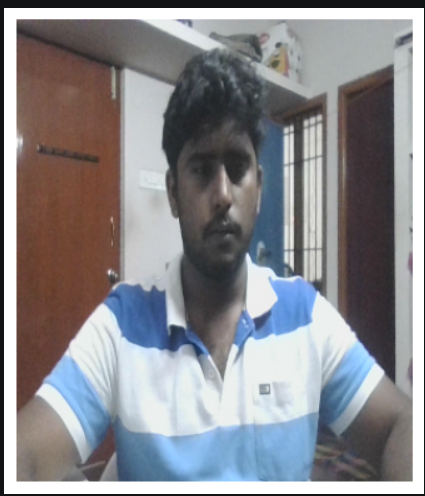
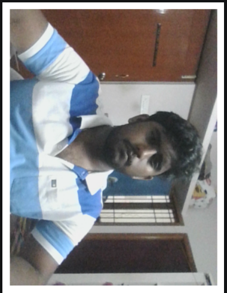

# Image Capture and Video Processing Using OpenCV

---

## Aim

To write a Python program using OpenCV to capture an image from the webcam and perform the following operations:

1. Write the frame as a JPG file  
2. Display the video  
3. Display the video by resizing the window  
4. Rotate and display the video  

---

## 🛠️ Software Used

- Anaconda – Python 3.7  
- Jupyter Notebook / VS Code  
- OpenCV (`cv2`)  

---

## ⚙️ Algorithm

### Step 1:
Import the required libraries and initialize the webcam using `cv2.VideoCapture()`.

### Step 2:
Capture frames continuously from the webcam.

### Step 3:
Save a frame as a JPG image using `cv2.imwrite()`.

### Step 4:
Display the live video stream using `cv2.imshow()`.

### Step 5:
Resize the frame and rotate it using OpenCV functions, then display the processed frames.

---

## 💻 Program

### Developed By:
#### Name:  Ashqar Ahamed S T

#### Register No: 212224240018  

```py
# Import required libraries
import cv2
import matplotlib.pyplot as plt
from IPython.display import clear_output
import time
```

```py
# Read the video 
cap = cv2.VideoCapture(0)
# Read a single frame
ret, frame = cap.read()

if ret:
    # Write the frame as a JPG file
    cv2.imwrite('frame.jpg', frame)

cap.release()

    
```

```py
# Display the captured frame using Matplotlib
cap_img = cv2.imread('frame.jpg')
cap_img = cv2.cvtColor(cap_img, cv2.COLOR_BGR2RGB)
plt.imshow(cap_img)
plt.title('Captured Frame')
plt.axis('off')
```

```py
# To Display the video 
cap = cv2.VideoCapture(0)

for i in range(50):
    ret, frame = cap.read()
    if not ret:
        break
    frame_rgb = cv2.cvtColor(frame, cv2.COLOR_BGR2RGB)
    clear_output(wait=True)
    plt.imshow(frame_rgb)
    plt.axis('off')
    plt.show()
    time.sleep(0.05)

cap.release()


```

```py
# Display the video by resizing the window
cap = cv2.VideoCapture(0)

for i in range(50):
    ret, frame = cap.read()
    if not ret:
        break
    resized_frame = cv2.resize(frame, (300, 350))
    frame_rgb = cv2.cvtColor(resized_frame, cv2.COLOR_BGR2RGB)
    clear_output(wait=True)
    plt.imshow(frame_rgb)
    plt.axis('off')
    plt.show()
    time.sleep(0.05)

cap.release()

```
```py
# Rotate and display the video
cap = cv2.VideoCapture(0)

for i in range(50):
    ret, frame = cap.read()
    if not ret:
        break
    rotated_frame = cv2.rotate(frame, cv2.ROTATE_90_CLOCKWISE)
    frame_rgb = cv2.cvtColor(rotated_frame, cv2.COLOR_BGR2RGB)
    clear_output(wait=True)
    plt.imshow(frame_rgb)
    plt.axis('off')
    plt.show()
    time.sleep(0.05)

cap.release()


```

---

## Output

### i) Write the frame as JPG image
Captured image is saved as `captured_img.jpg`



### ii) Display the video
Live webcam video is displayed



### iii) Display the video by resizing the window
Video is shown in resized resolution (300 × 350)



### iv) Rotate and display the video
Video is displayed after rotation (90° clockwise)



---

## Result

Thus, the image is successfully captured from the webcam and various video processing operations such as saving, displaying, resizing, and rotating are performed using OpenCV.
